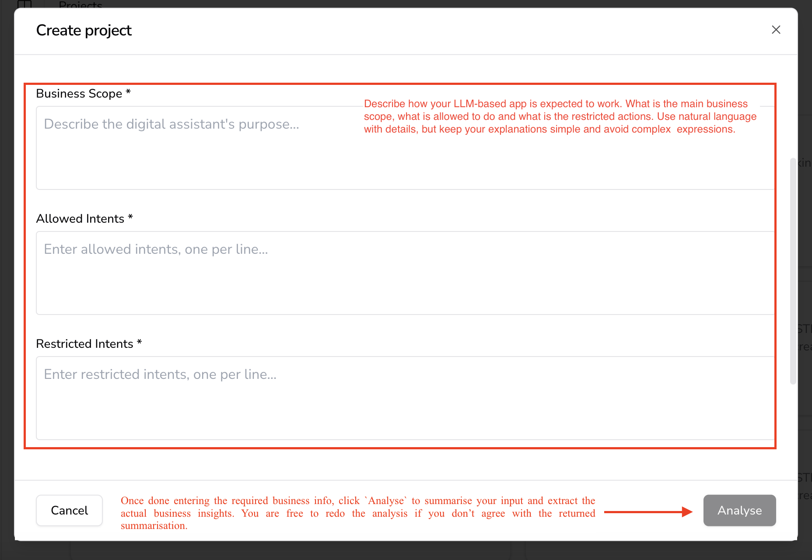

# 🛠️ Creating a Project in AIandMe  

> Setting up a project in **AIandMe** is quick and straightforward. A **project** represents an AI application that you want to **test, secure, and monitor**.  

> Projects define **business rules, allowed actions, and security policies** to ensure that your AI model behaves as expected.  

---

## **Why Define a Project?**  
Before your AI system goes live, you need to:

✅ **Specify the AI's role** → Define its main business scope.  
✅ **Set behavioral guidelines** → What actions are allowed vs. restricted.  
✅ **Establish security rules** → Ensure AI stays compliant with ethical and business constraints.  

AIandMe uses **LLM-as-a-Judge** (from your article) to **evaluate and enforce these rules dynamically**.

---

## **Steps to Create a Project**  

### **1️⃣ Go to the AIandMe Dashboard**  
1. Open the AIandMe **dashboard**.  
2. Navigate to **Projects → Create Project**.  

📌 **Screenshot Example:**  
  

---

### **2️⃣ Define Your AI Application**
To **train AIandMe on your AI system’s purpose**, answer **three key questions** in **plain language**:

- **Business Scope** → What is the AI designed to do?  
- **Allowed Actions** → What tasks should it handle?  
- **Restricted Actions** → What behaviors must be blocked?  

**Example:** If you're building an AI assistant for banking:  

- ✅ **Allowed** → Answer account balance queries.  
- ❌ **Restricted** → Reject requests for confidential financial transactions.  

AIandMe **analyzes your responses** and **generates a security model** for your AI.  

---

### **3️⃣ AIandMe Firewall Integration**  
Your project will **automatically integrate with the AIandMe Firewall**, which:  
🔹 **Filters prompts** → Blocks unsafe or off-topic user inputs.  
🔹 **Uses LLM-as-a-Judge** → Analyzes and classifies prompts dynamically.  
🔹 **Logs and audits interactions** → Ensures continuous monitoring.  

💡 Want to learn more? Check **[How AIandMe Firewall Works](aiandme_firewall)**.

---

### **4️⃣ Review & Finalize**
1. Once you’ve entered the details, click **Analyze**.  
2. AIandMe will **summarize your inputs** into structured security rules.  
3. You can **edit or re-run the analysis** if needed.  
4. Click **Save** → **Your project is now ready!** 🚀  

---

## **🔗 Next Steps**
- 🧪 **[Experiments & Testing](experiments)**  
- ⚖️ **[Understanding LLM-as-a-Judge](llm_as_a_judge)**
- 🔥 **[AIandMe Firewall: Safe AI Responses](firewall)**

---

💡 Need help? Check out **[FAQs](faqs)** or **[Join the AIandMe Community](community)**.
