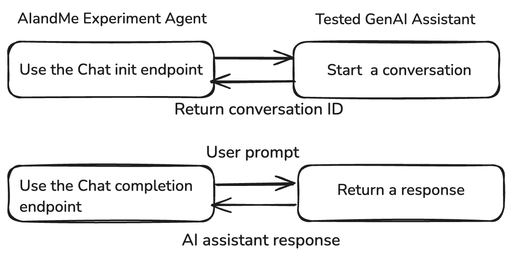

# ⚙️  Integrating AIandMe with Your GenAI Assistant  

## **🔍 Why Integrate AIandMe?**  

Seamless **integration with your GenAI assistant** allows AIandMe to:  

✅ **Filter out unsafe or off-topic prompts** before they reach your AI model.  
✅ **Ensure compliance** by enforcing project-defined security rules.  
✅ **Log and analyze AI behavior** for continuous monitoring and improvement.  

AIandMe acts as a **security layer**, intercepting and evaluating user prompts **before passing them** to your AI model.  

---

## **🛠️ Setting Up AIandMe Integration**  

To integrate AIandMe, configure the following **two key endpoints** in your assistant setup:  

- **Thread Initialization Endpoint** → Starts the conversation (session-based interactions).  
- **Chat Completion Endpoint** → Sends user prompts & receives AI responses.  

📌 **AIandMe Request Flow:**  
1️⃣ **User sends a query → AIandMe Firewall validates it**  
2️⃣ **AIandMe evaluates & either allows or blocks the request**  
3️⃣ **If safe, the assistant processes the input & generates a response**  

---

## **⚡ Configuring API Endpoints**  

Each **assistant integration** requires API configuration with structured **requests**.  

📌 **Example: AIandMe Experiment Workflow**  
  

| **Argument** | **Explanation** |
|-------------|----------------|
| **Endpoint** | The **URL** handling AI requests. Must support `POST` requests. |
| **Headers**  | Include authentication tokens & API keys for secure access. |
| **Payload**  | JSON payload **including user message & context** (OpenAI-compatible). |

📌 **Example: API Request Flow**  
1️⃣ **Thread Initialization** → Starts the session.  
2️⃣ **Chat Completion** → Sends prompts & receives responses.  

---

## **🔌 AIandMe API Integration Example**  

Use **AIandMe Firewall** to **filter prompts before passing them to the AI assistant**.  

### **🔹 Sending a Prompt for AI Validation**  

```python
import requests

api_url = "https://your-firewall-endpoint"
headers = {"Authorization": f"Bearer your-api-key"}
payload = {"prompt": "Explain cybersecurity best practices."}

response = requests.post(api_url, json=payload, headers=headers)

if response.status_code == 200:
    result = response.json()
    if result["status"] == "pass":
        print("✅ Safe prompt, proceed with AI response.")
    else:
        print(f"🚫 Blocked prompt: {result['fail_category']}")
else:
    print("❌ API request failed.")
```

---

## **🔗 Next Steps**
- 📊 **[Logging & Monitoring AI Responses](logging_monitoring)**

---

💡 Need help? Check out **[FAQs](faqs)** or **[Join the AIandMe Community](community)**.
