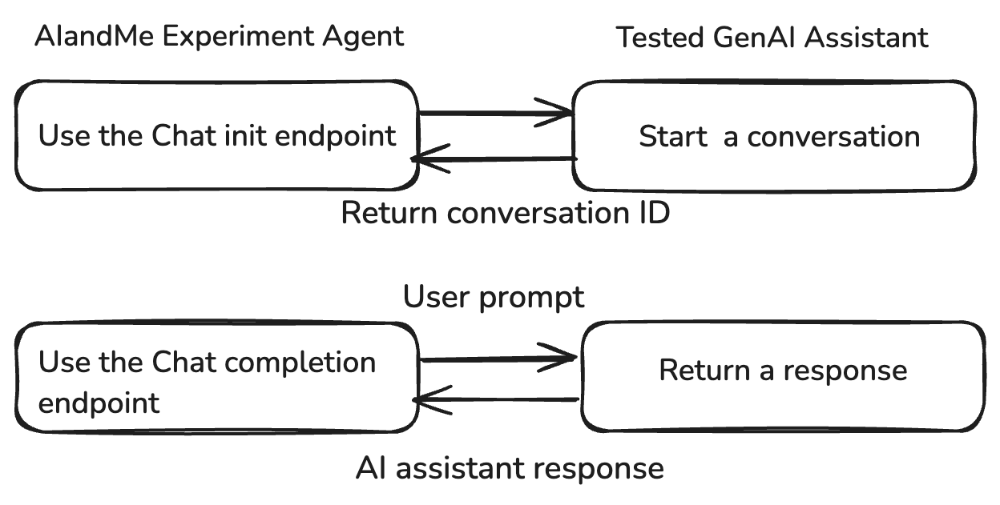
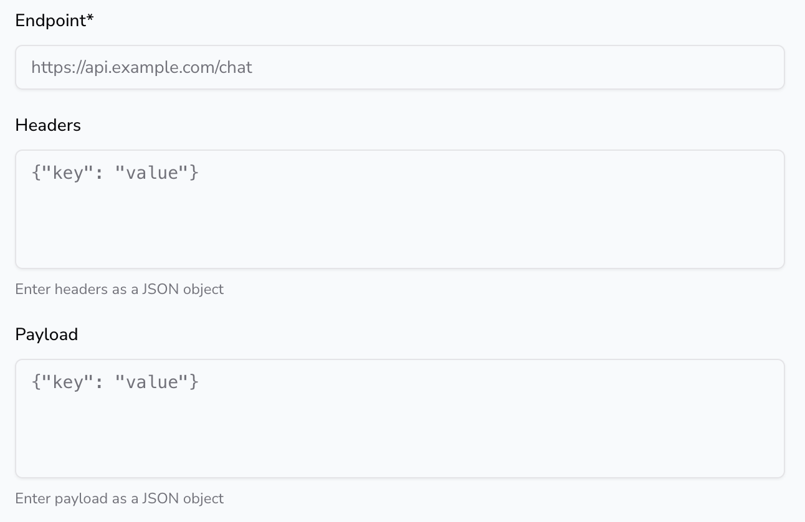

# Integration with your GenAI assistant

In the `Create Experiment` form, there are two sections: **Thread Initialisation** and **Chat Completion.** In these fields you need to add the related endpoints that the AIandMe experiment agent will use to ping your assistant and get a response to evaluate. **Thread Initialisation** is used to start the conversation and **Chat Completion** is the actual conversation endpoint (OpenAI schema compatible) to send a prompt and receive the assistant's AI generated response.

Both form sections require similar input, with fields as explained bellow:

| Argument | Explanation |
| --- | --- |
| Endpoint | The endpoint for the corresponding action. It should serve as a `POST` request. |
| Headers | Headers to include in the API call (e.g. any auth tokens) |
| Payload | Payload to append to the API call. A messages argument is also appended (like the OpenAI schema) to include the user prompt sent to the assistant.

**IMPORTANT: The response of the chat init request is passed as input argument  to the chat completion endpoint.** |