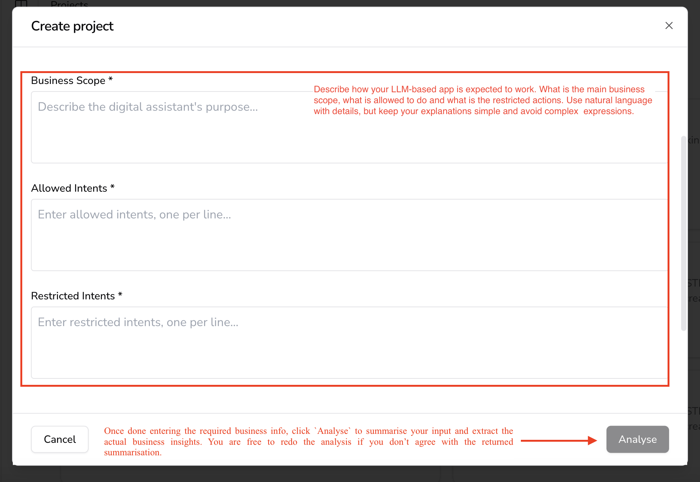

# Creating a project

To create a project, you only need to explain the business behind the operation of the LLM-based app you wish to test. Moreover, you only need to reply in natural language to the following 3 basic questions that define how your LLM-based app is expected to work, what is the main business scope, what is allowed to do and what is the restricted actions, as shown in the following screen:

Use natural language with details, but keep your explanations simple and avoid complex  expressions. Once done entering the required business info, click `Analyse` to summarise your input and extract the actual business insights. You are free to redo the analysis if you don’t agree with the returned summarisation.

That’s all! Your project is created and you can start integrating the AIandMe platform capabilities in your GenAI CI/CD.