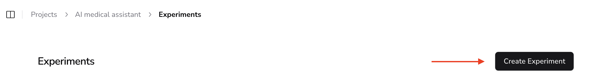

# Experiments - Testing during development

The AIandMe experiments is similar to a cybersecurity penetration testing, that iteratively performs attacks and evaluates how a system manages them. However, now we test the alignment of the underlying GenAI app with the expected behavior. Thus, the experiment is actually a contextual pen-test.

The process of the AIandMe experiments is summarised in the following pipeline:

.png)

Once you have created your project you can run an experiment, by following the steps bellow.

1. Navigate to your experiment’s page and click on `Create Experiment`

1. In the next form fill in the required details (like the name of the experiment, a description, etc.). You can select the model provider to use for running this experiment (i.e. the model to use for the LLM-as-a-Judge concept and the integration details with the assistant to test.
2. Once done with the required information complete the experiment creation.

Now the experiment runs in the background with the following steps:

**STEP 1: Adversarial synthetic data generation**

If there is no dataset for the project related to the current configuration of the project’s business scope (as mentioned earlier), it is now being created.

**STEP 2: Test of the GenAI assistant**

The adversarial synthetic prompts are sent one-by-one to the tested GenAI assistant and the response is evaluated against the expected behavior implied in the  project’s business scope (as mentioned earlier).

**STEP 3: Experiment completion**

When all the synthetic prompts are analysed, the final report is created with insights from the findings and all the logs are registered so as any human can review and give feedback or for later auditing purposes.

[Integration with your GenAI assistant](Integration%20with%20your%20GenAI%20assistant%20.md)