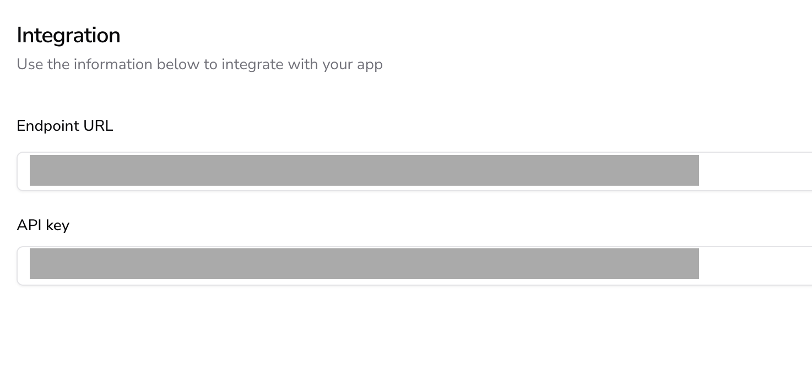

# 🔥 The AIandMe Firewall  

## **What is the AIandMe Firewall?**  

The **AIandMe Firewall** acts as a **context-aware AI security filter**, similar to a **traditional cybersecurity firewall** but tailored for **GenAI applications**. It **analyzes user prompts in real-time** and filters them based on **business rules, security constraints, and ethical guidelines** defined in your project settings.  

✅ **Prevents AI misuse** by filtering harmful, off-topic, or restricted inputs.  
✅ **Deploys automatically** when you create an AIandMe project.  
✅ **Scalable & low-latency** → Built on a **serverless architecture** for high performance.  

> **Find your Firewall API details in**:  
**Project Settings → Integration**  
Here, you'll get your **custom API endpoint & key** for integrating AIandMe with your GenAI assistant.  

  

---

## **Using the Firewall API**  

The AIandMe Firewall is **easy to integrate** with any AI system. Just send a `POST` request to your **project-specific endpoint**, and the firewall will evaluate the prompt in **two stages**:  

1️⃣ **Immediate Response** → Returns a **PASS/FAIL** verdict and a `log_id` for tracking.  
2️⃣ **Detailed Analysis** → The full explanation is retrievable later using the `log_id`.  

---

## **Installation & Dependencies**  

Install the **AIandMe Firewall SDK** via `pip`:  

```bash
pip install aiandme
```

---

## AIandMe Firewall Integration Example  

Here’s a **Python integration example**, showing how to use the **AIandMe Firewall API** in your application:  

```python
# Import necessary libraries
from aiandme import (
    Firewall,
    AIANDME_Firewall_CannotDecide,
    AIANDME_Firewall_NotAuthorised,
)
from aiandme.schemas import Integration as IntegrationSchema

# Initialize the firewall with project credentials (endpoint & API key)
fw = Firewall(
    IntegrationSchema(
        endpoint="https://your-firewall-endpoint",
        api_key="your-api-key",
    )
)

# Analyze a user prompt
try:
    user_prompt = "Request content for AI analysis..."
    response = fw.eval(user_prompt)

    if response.status:
        # ✅ Safe prompt → Send to AI assistant
        pass
    elif response.fail_category == "off_topic":
        print("🚫 Off-topic request")
    elif response.fail_category == "violation":
        print("🚫 Intent violation detected")
    elif response.fail_category == "restriction":
        print("🚫 Restricted action triggered")

except AIANDME_Firewall_CannotDecide:
    print("🤔 Firewall uncertain—manual review needed.")
except AIANDME_Firewall_NotAuthorised:
    print("⚠️ Authentication failed. Check your API credentials.")
except Exception as e:
    print(f"❌ Unexpected error: {e}")
```

---

## Two-Phase Firewall API Response  

To **optimize efficiency**, the **AIandMe Firewall API** returns results in **two phases**:  

1️⃣ **Instant Response** → Delivers a **log ID** and a **quick PASS/FAIL assessment** for real-time filtering.  
2️⃣ **Detailed Analysis** → The **full explanation** of the AI evaluation can be retrieved later using the **log ID**.  

---

## Open-Source
The **AIandMe Firewall** is released as **open-source 🌍 software** to **promote responsible AI usage** and support AI security development, for more details & contributions → [**GitHub Repository**](https://github.com/aiandme-io/firewall)  

---

## **🔗 Next Steps**
- ⚙️  **[AIandMe Integration](aiandme_integration)**  
- 📊 **[Logging & Monitoring AI Responses](logging_monitoring)**

---

💡 Need help? Check out **[FAQs](faqs)** or **[Join the AIandMe Community](community)**.
