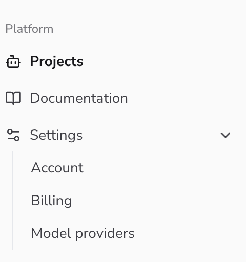
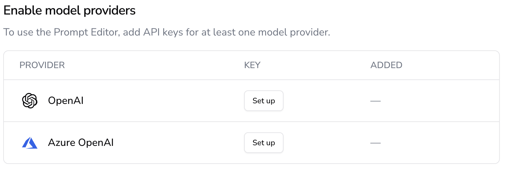

# Model Providers

The AIandMe Firewall relies on the LLM-as-a-Judge concept to leverage the cognitive capabilities of the GenAI technology. In that framework, an LLM interferes and analyses how a user prompt aligns with the expected business operation of the underlying GenAI assistant, and, depending the deviation it delivers a verdict: **pass** or **fail**, i.e., whether the user input leads the assistant towards the expected business behavior of should be filtered out.

You can integrate with you own Model Provider to be used as the LLM judge within your organisation. To set up your model provider follow the steps bellow:

1. Navigate to the organisations settings page and click on `Model Providers`

1. In the next page, select the Model Provider that match your needs.  Click on `Set up` to open the form allowing you to add the required integration details (e.g. endpoints, api keys, etc.) Currently we support OpenAI and Azure OpenAI integrations, but more providers will be added soon.

###