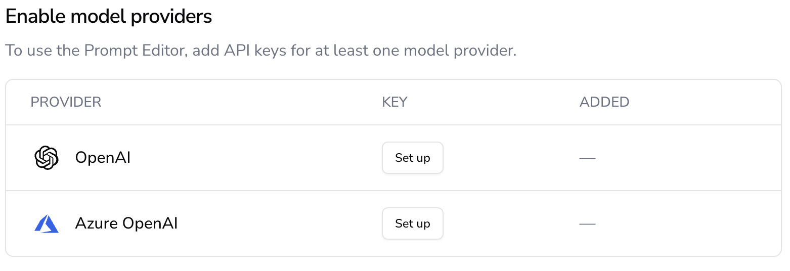

# 🔌 Setting Up Model Providers

AIandMe allows you to **integrate your own model provider** as an evaluator using the **LLM-as-a-Judge** concept. This means you can use a **custom LLM** (such as OpenAI or Azure OpenAI) to analyze **user prompts** and decide whether they align with your application's expected behavior.

AIandMe classifies each prompt as:  
✅ **Pass** → The input aligns with the AI assistant’s intended use.  
❌ **Fail** → The input is out of scope and should be blocked.  

---

## **🔗 Supported Model Providers**
Currently, AIandMe supports:  
- **OpenAI (GPT-4, GPT-4-turbo, etc.)**  
- **Azure OpenAI**  
- **More providers coming soon!**  

You can configure any of these as your **LLM judge** to power the AIandMe Firewall.

---

## **⚙️ How to Set Up a Model Provider**
Follow these steps to **connect your own model provider**:

### **1️⃣ Open Model Provider Settings**
Go to **AIandMe Dashboard** → **Settings** → **Model Providers**.

📌 **Screenshot Example:**  

---

### **2️⃣ Choose a Model Provider**
On the **Model Providers** page, select the provider you want to integrate (e.g., OpenAI, Azure OpenAI).

📌 **Screenshot Example:**  

---

### **3️⃣ Configure API Credentials**
Click **"Set Up"** and enter the required details:
- **API Endpoint** → The provider’s URL for model requests.
- **API Key** → Your authentication key for secure access.
- **Model Selection** → Choose which LLM will act as the judge.
- **Other settings** (varies by provider).

After filling in the details, click **Save**.

---

## **🔬 How you can benefit**
Once your model provider is connected, you can:

🔹 **Run AI evaluations using LLM-as-a-Judge**.  
🔹 **Fine-tune the firewall to allow or block responses**.  
🔹 **Test with real-world prompts and analyze logs**.  

## **🔗 Next Steps**
- 🛠️ **[Creating a Project](creating_a_project)**  
- 🧪 **[Experiments & Testing](experiments)**  
- ⚖️ **[Understanding LLM-as-a-Judge](llm_as_a_judge)**

---

💡 Need help? Check out **[FAQs](faqs)** or **[Join the AIandMe Community](community)**.
